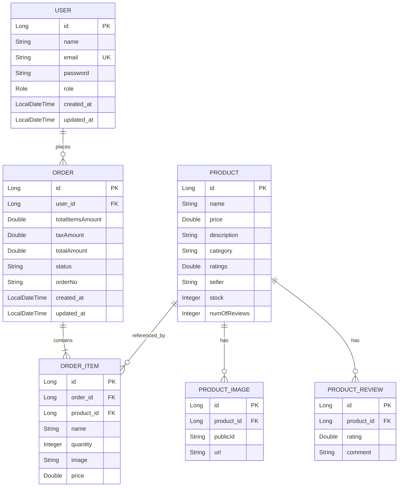

# E-Commerce Database Schema

## Entity-Relationship Diagram

## Tables Overview

| Table | Description |
|-------|-------------|
| **users** | Stores user accounts with roles (USER/ADMIN) |
| **products** | Product catalog with ratings, stock, and seller info |
| **product_image** | Multiple images per product (publicId, url) |
| **product_review** | User reviews with ratings (1-5) for products |
| **orders** | Customer orders with totals, tax, and status |
| **order_items** | Line items linking orders to products |

## Relationships

| Relationship | Type | Description |
|--------------|------|-------------|
| User → Order | One-to-Many | One user can place many orders |
| Order → OrderItem | One-to-Many | One order contains multiple items |
| Product → ProductImage | One-to-Many | Product can have multiple images |
| Product → ProductReview | One-to-Many | Product can have multiple reviews |
| Product → OrderItem | One-to-Many | Product can be in multiple order items |

## Table Details

### users
| Column | Type | Constraints |
|--------|------|-------------|
| id | Long | PRIMARY KEY, AUTO_INCREMENT |
| name | String | NOT NULL, 2-100 chars |
| email | String | NOT NULL, UNIQUE |
| password | String | NOT NULL, min 6 chars |
| role | Enum | NOT NULL (USER, ADMIN) |
| created_at | LocalDateTime | NOT NULL |
| updated_at | LocalDateTime | |

### products
| Column | Type | Constraints |
|--------|------|-------------|
| id | Long | PRIMARY KEY, AUTO_INCREMENT |
| name | String | NOT NULL |
| price | Double | NOT NULL, >= 0 |
| description | String | NOT NULL |
| category | String | |
| ratings | Double | default 0.0 |
| seller | String | NOT NULL |
| stock | Integer | NOT NULL |
| numOfReviews | Integer | default 0 |

### product_image
| Column | Type | Constraints |
|--------|------|-------------|
| id | Long | PRIMARY KEY, AUTO_INCREMENT |
| product_id | Long | FOREIGN KEY → products(id) |
| publicId | String | |
| url | String | |

### product_review
| Column | Type | Constraints |
|--------|------|-------------|
| id | Long | PRIMARY KEY, AUTO_INCREMENT |
| product_id | Long | FOREIGN KEY → products(id) |
| rating | Double | 1-5 |
| comment | String | |

### orders
| Column | Type | Constraints |
|--------|------|-------------|
| id | Long | PRIMARY KEY, AUTO_INCREMENT |
| user_id | Long | FOREIGN KEY → users(id) |
| totalItemsAmount | Double | |
| taxAmount | Double | |
| totalAmount | Double | |
| status | String | |
| orderNo | String | |
| created_at | LocalDateTime | NOT NULL |
| updated_at | LocalDateTime | |

### order_items
| Column | Type | Constraints |
|--------|------|-------------|
| id | Long | PRIMARY KEY, AUTO_INCREMENT |
| order_id | Long | FOREIGN KEY → orders(id) |
| product_id | Long | FOREIGN KEY → products(id) |
| name | String | |
| quantity | Integer | |
| image | String | |
| price | Double | |
